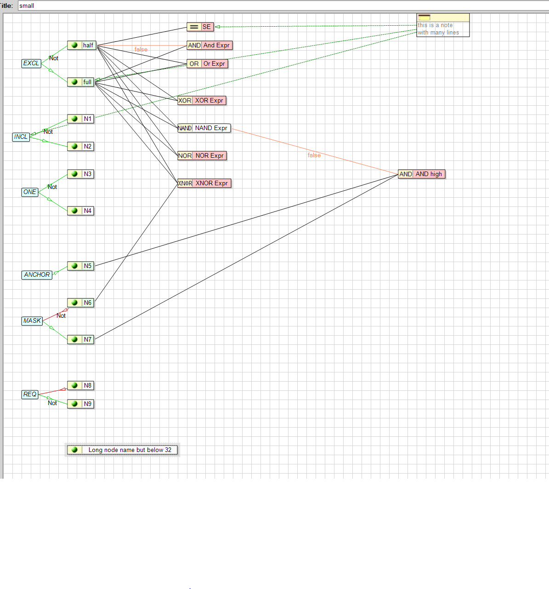

=  CEG und RBT Notizen
:doctype: book
:toc: left
:experimental:

== Issues in RBT

* Node Dialog doesn't close when pressing kbd:[ESC]
* RBT adds UI-Type not in RBT.cfg
* RBT asks for saving after starting without having changed the model +
  I'm not shure if this also happens when load last model on startup is activated.
* Dialog Edit Node appears partly outside of screen if using 3 monitors
* multiple links from note to a tag are possible

== Requirements for cegr (Cause Effect Graph)

* strong builder rules
* easy to use
* easy to compose
* ability to define components

== Display

https://plantuml.com/de/[PlantUML]

https://graphviz.org/[GraphViz]

https://asciidoctor.org/docs/[AsciiDoctor]

== Generator
Scala code now in *.sc

== Important classes

all concrete Classes are fully uppercase +
execption: one Character (D, E..) are Helper classes for Import. +
To be refactored

* CEG -> Cause Effect Graph
* CSE -> Cause
* AND, OR ... -> Logic / possible Effects
* EXCL, INCL ... -> Constraint
* NOTE -> Note

== Misc

